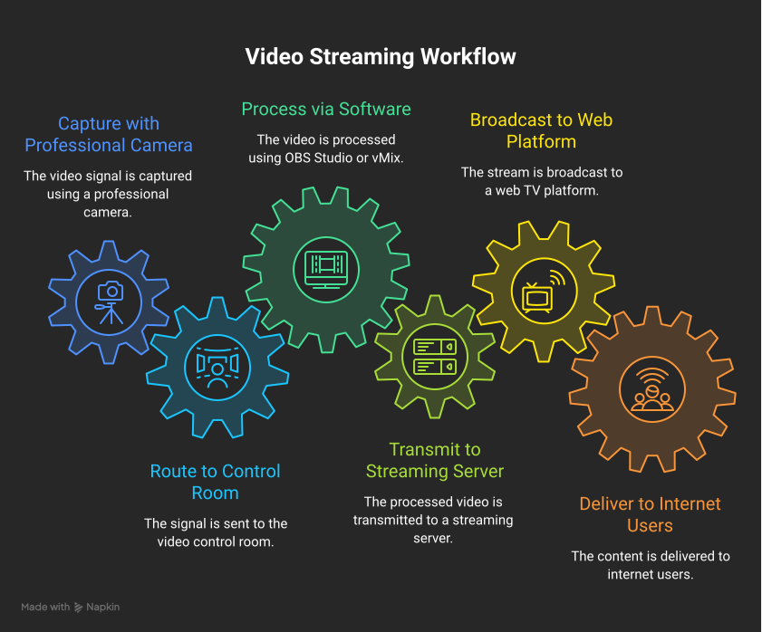
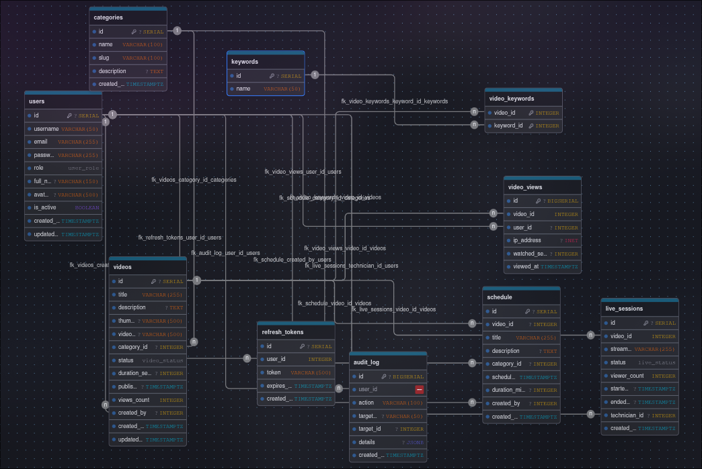
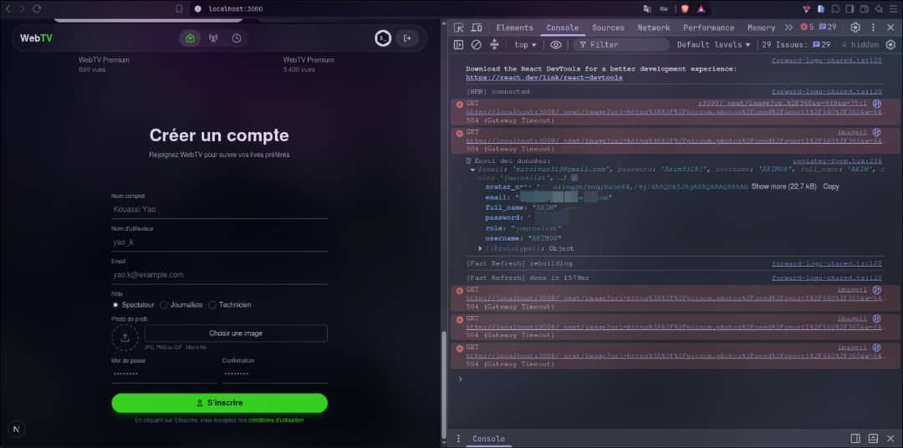
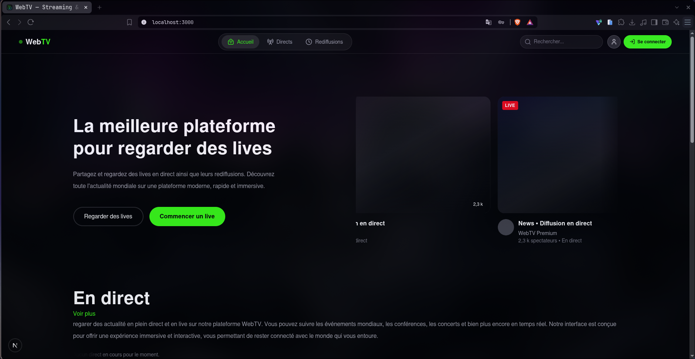
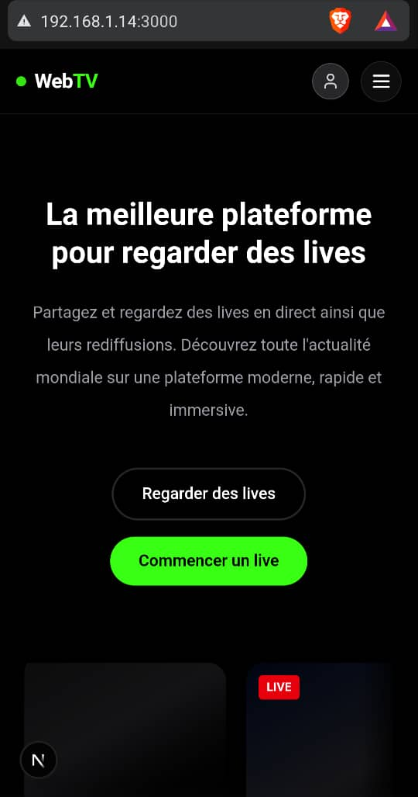

Two weeks ago, my PHP teacher asked me to build a project with three of my classmates. 

He told us to build a WebTV, honestly that was my first time to hear about it. 

- A WebTV? I asked. 
- He said : yes a WebTV, It is a platform where people can stream live, host broadcasts, and replay previous streams.  

I agreed to work on the project. As the project lead, I did the loading dock and we showed him, he gave us the kickoff.

I also did the workflow and here is what it looks like : 



I worked on the Database. I used PostgreSQL Through Supabase, here's a preview I created with [DrawDB](https://www.drawdb.app/) : 



My friends worked on : 

- [x] The UI and UX
- [x] The interface
- [x] The APIs
- [x] The business logic

As the project lead, I also had to make sure that different parts of the application worked together properly from end to end and I discovered a serious security issue. When someone tried to sign up, their data was being displayed in the browser console, including their email and password.




I found that the issue was caused by a debugging line that was logging the form data to the browser console : 

```javascript
console.log("Envoi des données:", formData);
```

We're not done with that yet but here is what it looks like : 


#### Computer interface



#### Phone interface




Can't wait to see it online!