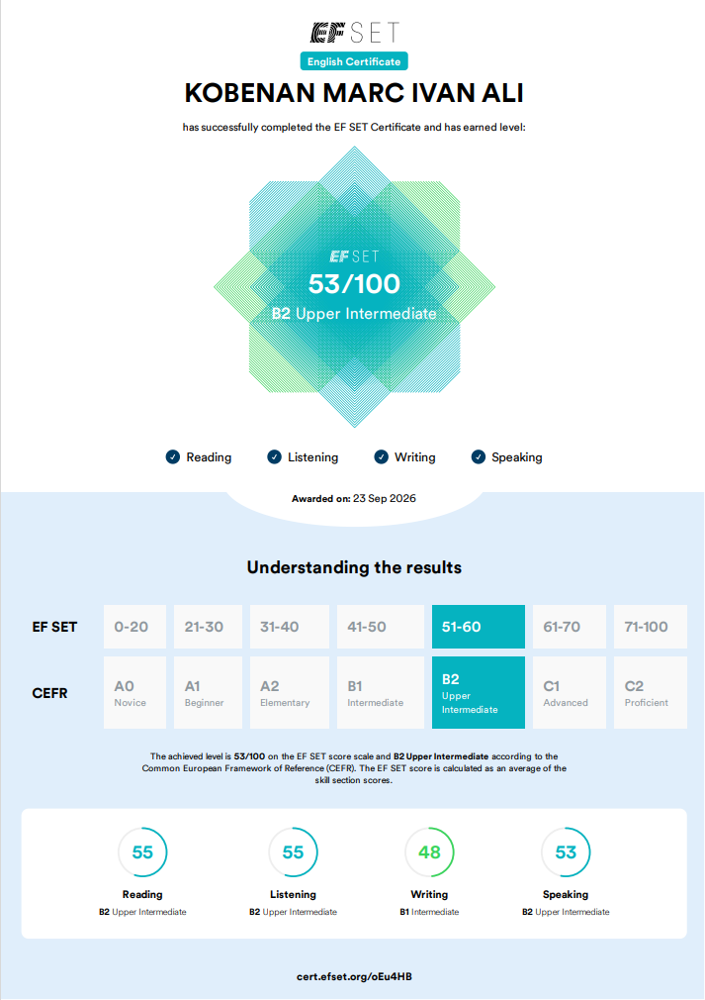

# Reaching B2 Upper Intermediate on the EF SET Test

I recently took the [EF SET](https://www.efset.org/4-skill/launch/) English certification test to evaluate my overall level in English. My official score came out to **53/100**, placing me at the **B2 Upper Intermediate** level on the Common European Framework of Reference (CEFR) scale.

Testing my language skills periodically helps me track my progress and identify areas where I need more practice.

---

### Score Breakdown

Here is a detailed breakdown of my results across the four key skill areas:

| Skill | Score | CEFR Level |
| :--- | :--- | :--- |
| **Reading** | 55 / 100 | B2 Upper Intermediate |
| **Listening** | 55 / 100 | B2 Upper Intermediate |
| **Speaking** | 53 / 100 | B2 Upper Intermediate |
| **Writing** | 48 / 100 | B1 Intermediate |

---

### Key Takeaways and Next Steps

* **Strengths:** My reading, listening, and speaking are consistently in the B2 range, allowing me to comfortably follow technical documentation, hold conversations, and consume content in English.
* **Focus Area:** My writing score landed at B1, which highlights an area I need to practice more. I plan to focus on writing articles, documentation, and technical breakdowns more frequently to bring my written expression up to the same level as my comprehension and speaking.

Continuous learning is part of the process, and this milestone gives me a clear direction for what to work on next.