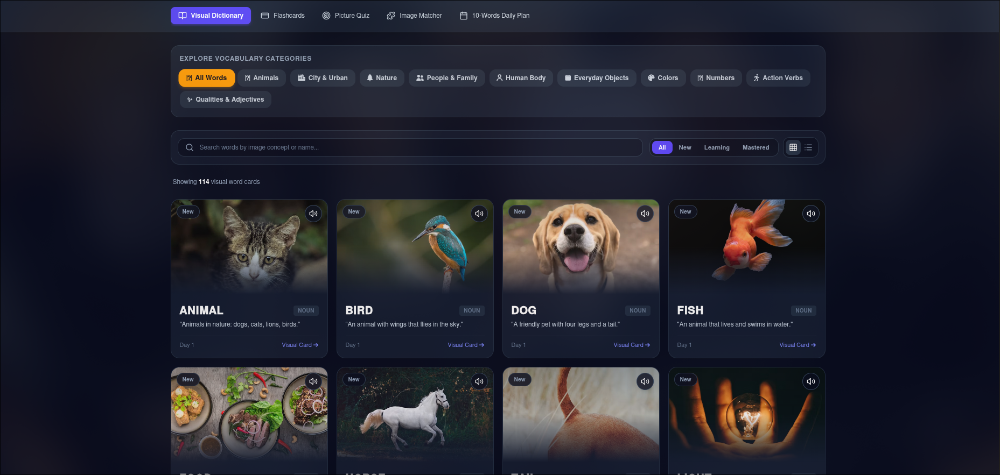

Two years ago, I decided to learn English. 

That was an incredible decision because I met amazing people, and now I'm able to have conversations in English.

Lately, I decided to assist some friends in their English-learning journey. 

When I started learning English, I learned the **50 most common words in English** with their French translations. I later figured out that it wasn't the best way to learn vocabulary.

I really think that learning words through images can be more effective than translating them into our native languages. 

To help my friends improve their vocabulary, I created a little vocabulary trainer with [Google AI Studio](https://aistudio.google.com). 

I built it in a single day, and now they feel more comfortable learning new vocabulary.

Here's what it looks like : 

Here's the link if you want to give it a try : 

**Link :** [Vocabulary Trainer by AKIM](https://visual-english-vocabulary-builder.ai.studio/)

I don't think a language should simply be learned. It should be lived.